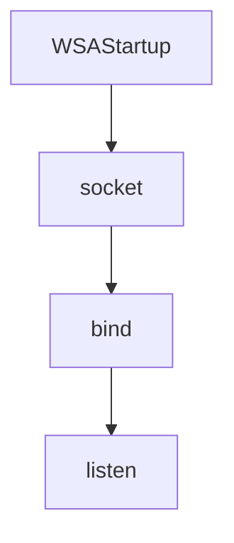
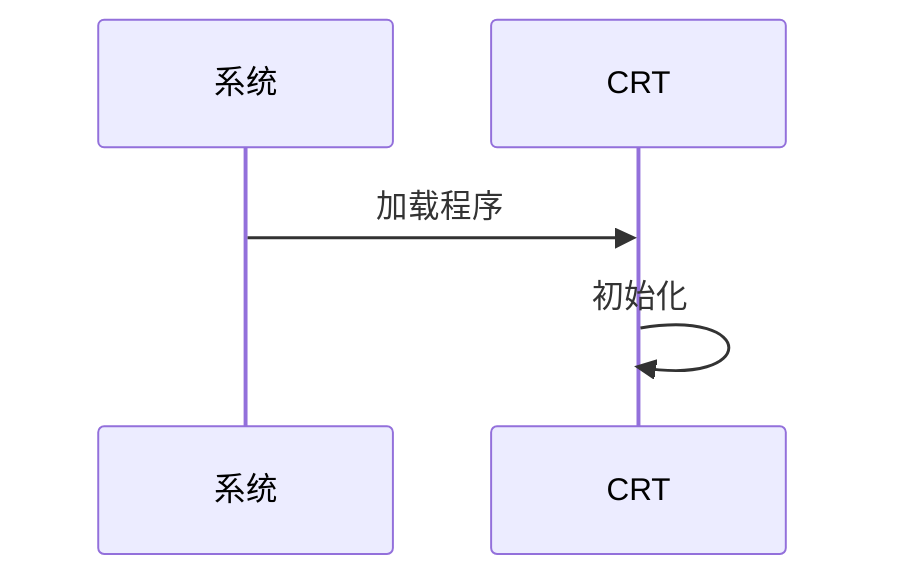

# Mermaid to Draw.io 转换器

## 功能概述

将Mermaid图表代码解析后，使用Draw.io MCP工具重新绘制为可编辑的Draw.io图形。

---

## 支持的图表类型

| 类型 | Mermaid关键词 | 布局 |
|------|--------------|------|
| 流程图 | `flowchart TD/LR` | 垂直/水平 |
| 时序图 | `sequenceDiagram` | 参与者+消息 |
| 子图 | `subgraph` | 带边框容器 |

---

## 样式模板 (Style Templates)

### 节点颜色方案

| 用途 | fillColor | strokeColor | 说明 |
|------|-----------|-------------|------|
| 开始/初始化 | #d5e8d4 | #82b366 | 绿色 |
| 普通步骤 | #dae8fc | #6c8ebf | 蓝色 |
| 判断/条件 | #fff2cc | #d6b656 | 黄色 |
| 重要/高亮 | #e1d5e7 | #9673a6 | 紫色 |
| 结束/清理 | #f8cecc | #b85450 | 红色 |
| 容器/分组 | #f5f5f5 | #666666 | 灰色 |

### 常用样式字符串

```
# 圆角矩形
whiteSpace=wrap;html=1;fillColor=#dae8fc;strokeColor=#6c8ebf;rounded=1;

# 菱形（判断）
whiteSpace=wrap;html=1;fillColor=#fff2cc;strokeColor=#d6b656;shape=rhombus;

# 虚线边框容器
whiteSpace=wrap;html=1;fillColor=#f5f5f5;strokeColor=#666666;rounded=1;dashed=1;strokeWidth=2;

# 生命线（时序图）
strokeColor=#6c8ebf;strokeWidth=2;dashed=1;fillColor=none;

# 标题（无边框）
whiteSpace=wrap;html=1;fillColor=none;strokeColor=none;fontSize=14;fontStyle=1;
```

### 边/箭头样式

```
# 标准箭头：默认使用小号空心箭头，避免大号实心箭头抢占视觉焦点
edgeStyle=orthogonalEdgeStyle;rounded=0;orthogonalLoop=1;jettySize=auto;html=1;endArrow=open;endFill=0;endSize=6;strokeWidth=2;

# 垂直连接（上到下）
exitX=0.5;exitY=1;exitDx=0;exitDy=0;entryX=0.5;entryY=0;entryDx=0;entryDy=0;

# 水平连接（左到右）
exitX=1;exitY=0.5;exitDx=0;exitDy=0;entryX=0;entryY=0.5;entryDx=0;entryDy=0;

# 虚线箭头（返回）：同样保持小号空心箭头
dashed=1;endArrow=open;endFill=0;endSize=6;strokeWidth=2;
```

手写 SVG 时，箭头 marker 也应使用小号空心样式：`markerWidth/markerHeight` 约 6-7，`path` 使用 `fill="none"`、`stroke="当前线条颜色"`、`stroke-linecap="round"`、`stroke-linejoin="round"`，不要使用大号实心三角箭头。

---

## 转换流程

### 1. 解析Mermaid代码

识别图表类型和元素：

```
flowchart TD
    A[步骤1] --> B[步骤2]
    B --> C{判断}
    C -->|是| D[结果1]
    C -->|否| E[结果2]
```

解析为：
- 节点: A, B, C, D, E
- 边: A→B, B→C, C→D(是), C→E(否)
- 形状: A,B,D,E=矩形, C=菱形

### 2. 计算布局

**flowchart TD (垂直)**:
- x: 居中 (如300)
- y: 每层间隔80px

**flowchart LR (水平)**:
- x: 每列间隔170px
- y: 并行节点垂直分布

**sequenceDiagram**:
- 参与者: 水平排列，间隔170px
- 生命线: 垂直虚线
- 消息: 水平箭头/消息框

### 3. 创建元素

使用MCP工具按顺序创建：

1. **容器/标题** (如有subgraph)
2. **所有节点** (并行创建)
3. **所有边** (并行创建)

---

## 快速参考

### Flowchart 节点映射

| Mermaid语法 | 形状 | Draw.io样式 |
|------------|------|-------------|
| `A[文本]` | 矩形 | `rounded=1;` |
| `A{文本}` | 菱形 | `shape=rhombus;` |
| `A([文本])` | 圆角 | `rounded=1;arcSize=50;` |
| `A((文本))` | 圆形 | `ellipse;` |

### SequenceDiagram 元素映射

| Mermaid语法 | 元素 | 说明 |
|------------|------|------|
| `participant A` | 矩形 + 虚线 | 参与者头部+生命线 |
| `A->>B: 消息` | 带标签的边 | 实线箭头 |
| `A-->>B: 消息` | 带标签的边 | 虚线箭头 |
| `A->>A: 消息` | 自环消息框 | 消息框放在生命线旁 |

---

## 布局常量

```
# 流程图 (TD)
NODE_WIDTH = 200
NODE_HEIGHT = 50
VERTICAL_GAP = 80
START_X = 300
START_Y = 50

# 流程图 (LR)
HORIZONTAL_GAP = 170
PARALLEL_GAP = 100

# 时序图
PARTICIPANT_WIDTH = 120
PARTICIPANT_HEIGHT = 40
PARTICIPANT_GAP = 170
LIFELINE_HEIGHT = 500
MESSAGE_GAP = 45
```

---

## 执行模式

为节省token，采用以下策略：

1. **批量创建节点**: 所有独立节点在一次请求中并行创建
2. **批量创建边**: 所有边在一次请求中并行创建
3. **复用样式**: 使用上方定义的样式模板，不重复说明
4. **最小输出**: 完成后只输出简要总结

---

## 示例：Flowchart TD 转换

输入:


执行:
1. 创建4个节点 (y: 50, 130, 210, 290)
2. 创建3条边

输出总结:
```
已创建流程图：4个节点，3条边
起始位置: (300, 50)
```

---

## 示例：SequenceDiagram 转换

输入:


执行:
1. 创建2个参与者矩形 (x: 100, 270)
2. 创建2条生命线
3. 创建消息箭头/框

---

## 注意事项

1. 图形会创建在当前Draw.io页面，注意检查起始位置避免覆盖
2. 复杂时序图的自环消息可能需要手动调整位置
3. 建议用户在Draw.io中进行最终微调
