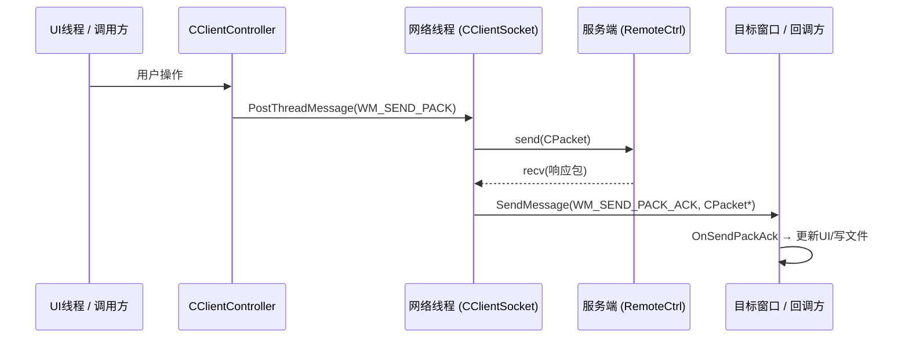
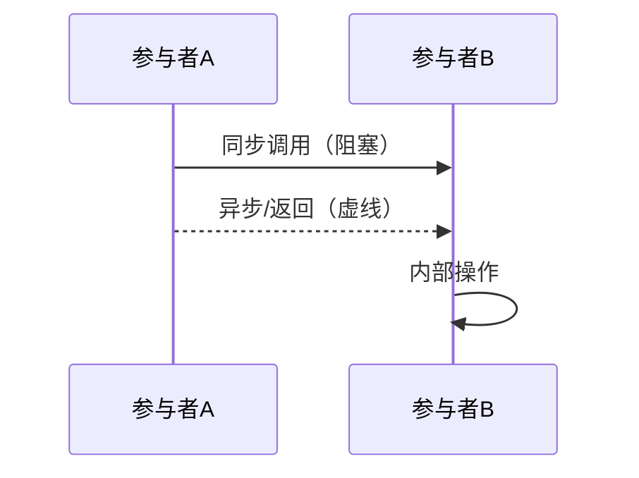
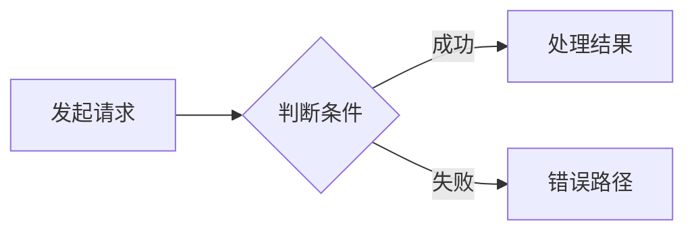

# Remote-Ctrl-Note — 远控系统项目笔记管理

## 核心原则

1. **先读 Git，再读代码**：通过 git diff 精准定位变更，不读无关文件
2. **链路优先，代码其次**：先把请求→网络→响应→回调的完整链路讲顺，再进代码细节
3. **Mermaid 优先 SVG**：多方交互用 `sequenceDiagram`，机制对比用 `flowchart`；只有局部结构补充才用 SVG 绘制
4. **不重复已讲内容**：已有笔记中的概念用 `[[wiki-link]]` 引用，不展开
5. **Bug 下沉**：主笔记只保留 Bug 结论和入口链接，详细过程进 Debug 日志
6. **教学口吻**：直白好懂，带着读者走一遍，不故作高深，不用奇怪比喻

---

## 项目信息

| 项目 | 路径 |
|------|------|
| 被控端 | `D:\c++\project\remote_ctl\remote_ctl\RemoteCtrl\RemoteCtrl` |
| 控制端 | `D:\c++\project\remote_ctl\remote_ctl\RemoteCtrl\RemoteClient` |
| 笔记根目录 | `D:\obsidian\C++\6.项目\远控系统` |
| Debug 日志 | `D:\obsidian\C++\6.项目\远控系统\0. Debug日志` |
| **主笔记模板** | `D:\obsidian\C++\模版\远控系统模版笔记.md` |
| **Debug 模板** | `D:\obsidian\C++\模版\远控系统Debug日志模版.md` |

---

## 执行流程

### 第一步：读 Git 提交

```bash
cd "D:\c++\project\remote_ctl\remote_ctl\RemoteCtrl"
git log --oneline -10
git log -1 --stat
git diff HEAD~1 HEAD -- "*.cpp" "*.h"
# 或指定 commit：
git show <commit> -- "*.cpp" "*.h"
```

用 diff 判断：新功能 / 重构 / Bug 修复？哪些文件真正有变化？

### 第二步：只读有变化的文件

根据 diff 结果，只打开发生变化的函数和类。

### 第三步：检查已有笔记

参考本文末的**已有笔记索引**，确认哪些内容已有笔记，避免重复。

### 第四步：选模板，决定笔记类型

| 场景 | 模板 | 笔记位置 |
|------|------|---------|
| 新功能 / 架构 / 链路演进 / 重构 | `远控系统模版笔记.md` | 对应章节目录 |
| Bug 修复为主 | `远控系统Debug日志模版.md` | `0. Debug日志/Debug-XXX xxx.md` |
| 两者兼有 | 两个都建，互相链接 | 各自位置 |

判断依据：
- **主笔记**回答：功能怎么变了？链路现在怎么走？哪个类负责什么？
- **Debug 日志**回答：怎么触发的？怎么排查的？根因是什么？怎么验证的？

### 第五步：写笔记

---

## 主笔记写作规范

基于 `远控系统模版笔记.md`，按以下顺序写，不相关的章节直接删掉：

### 推荐教学顺序

```
1. 先说这次改了什么        ← 表格，让读者建立全局印象
2. 和上一版是什么关系      ← 对比表 + 旧/新机制 flowchart
3. 先把主链路讲顺          ← sequenceDiagram，再配自然语言
4. 核心实现                ← 小块代码 + 逐段讲解
5. 如果这次还带了 bug      ← 只放结论和 [[Debug-XXX]] 入口
6. 当前版本的准确结论      ← 做对了什么，还没收口什么
7. Win32/Winsock/MFC 机制  ← 只讲本篇真正需要的 API
8. 易错点与调试
9. 代码索引
```

### 第 2 节：旧/新机制对比

对比时用 SVG 画图，让读者一眼看懂：谁阻塞、谁不阻塞、响应归谁处理。


### 第 3 节：主链路时序图

**每篇主笔记都应有链路时序图**。用 `sequenceDiagram`，节点名称对应项目真实的类/线程/函数名：



### 第 4 节：核心实现代码规范

代码要拆成小块，每块都要有讲解，顺序从整体到细节：

```cpp
void SomeFunction(...)
{
    // ===== 1. 这一步在链路中的作用 =====
    // 先说"负责什么"，不要上来就掉进局部细节

    // ===== 2. 关键处理步骤 =====
    // 依赖了什么 API 或框架机制

    // ===== 3. 容易出错的细节 =====
    // 涉及线程/消息/生命周期/协议边界时直接点出
}
```

每段代码后按顺序讲：
1. **整体职责**：在链路中负责哪一段
2. **输入和输出**：接收什么，结果交给谁
3. **关键步骤**：按顺序做了几件事
4. **API 说明**：用到了什么 Win32/MFC/Winsock API，为什么选它（而不是旁边那个）
5. **风险点**：这里最容易出 Bug 的地方

---

## Debug 日志写作规范

基于 `远控系统Debug日志模版.md`，保留以下章节：

```
Bug 基本信息（表格：编号/严重度/分类/commit/触发条件）
现象描述（操作步骤 + 可见症状）
调试过程（按排查顺序，展示如何缩小范围）
根因分析（问题代码 + 推理链）
修复方案（修复代码 + 关键点说明）
修复效果（修复前后对比，简单 Bug 可删）
底层原理（可选，涉及值得深挖的机制时保留）
调试经验（可复用的教训，加入 Debug 经验汇总）
```

**编号规则**：Glob `Debug-*.md`，取最大编号 +1。

---

## 图表使用规范

### sequenceDiagram — 多方交互、请求/响应时序

适合：C/S 通信流程、跨线程消息传递、ACK 回调链路



### flowchart — 机制对比、线程流转、单条链路分支

适合：旧/新机制对比、线程切换点、状态机分支



### SVG — 仅用于局部结构补充

适合：缓冲区内存布局、小范围调用链说明。**可以使用 SVG 代替整张机制图。**

SVG 箭头默认使用小号空心样式：`markerWidth/markerHeight` 约 6-7，`path` 使用 `fill="none"` + `stroke`，不要使用大号实心三角箭头。


## Bug 修复识别

当 diff 中出现以下特征时，触发创建 Debug 日志：

| 特征 | 示例 |
|------|------|
| commit message 含关键词 | `fix` / `bug` / `修复` / `崩溃` |
| 边界条件修改 | `>` → `>=` |
| 类型修正 | `int` → `intptr_t` |
| 资源释放添加 | `delete[]` / `fclose` / `CloseHandle` |
| 空指针/状态机修复 | 添加 `!= NULL` 判断、状态重置 |
| memmove/memcpy 参数修正 | 参数顺序、长度计算修正 |

处理流程：
1. Glob `Debug-*.md`，确认最大编号
2. 从 `远控系统Debug日志模版.md` 建新文件 `Debug-XXX xxx.md`
3. 在主笔记中添加 `[[Debug-XXX ...]]` 入口（"如果这次还带了 bug" 章节）
4. 在 Debug 日志中回链主笔记
5. 更新 `Debug 经验汇总与方法论.md`

---

## 已有笔记索引

写新笔记前先查，已有的内容用 wiki-link 引用，不要重新展开：

| 笔记 | 已讲解的内容 |
|------|-------------|
| [[2.1 网络编程基本设计]] | Winsock 初始化、socket/bind/listen/accept |
| [[2.2 网络编程架构设计]] | CServerSocket 单例模式、CHelper 自动释放 |
| [[2.3 设计网络传输包协议]] | CPacket 完整实现、协议格式、粘包处理、校验和 |
| [[2.4 获取磁盘分区信息]] | GetLogicalDriveStrings、命令处理框架 |
| [[3.1 锁机处理]] | threadLockDlg、LockMachine、Win32 锁机 API |
| [[4.1 文件下载功能的实现]] | 文件下载基础流程、分块传输、服务端发送逻辑 |
| [[4.4 远程桌面显示功能设计与数据接收发送]] | 截图/显示链路、图像数据收发 |
| [[6.1 初步完成控制层]] | CClientController 基本架构 |
| [[6.5 重构网络模块（线程事件机制→消息机制）]] | 消息机制重构背景 |
| [[6.7 消息机制闭环：窗口回调与上下文透传]] | WM_SEND_PACK_ACK 回调机制、lParam 上下文透传 |
| [[6.11 远程显示链路收口：回调渲染、请求节流与失败清理]] | 截图链路收口、200ms 节流、PostThreadMessage 失败路径 |
| [[6.12 文件树展示与下载缓冲区双 Bug 修复]] | LoadFileInfo 异步化、memmove 修正、下载完成检测 |

### Debug 日志目录

| 路径 | 说明 |
|------|------|
| `0. Debug日志/` | 所有 Debug-XXX 日志（当前最新：Debug-023） |
| `0. Debug日志/Debug 经验汇总与方法论.md` | 索引、分类统计、调试方法论 |

---

## 质量检查清单

- [ ] 读过 git diff，精准定位变更范围
- [ ] **主链路有 sequenceDiagram**（每篇主笔记必须有）
- [ ] 旧/新机制对比有 flowchart 或对比表
- [ ] 关键代码块都有讲解，没有裸代码
- [ ] API 说明聚焦项目上下文，讲了"为什么选它"
- [ ] Bug 修复内容已下沉到 Debug 日志
- [ ] 主笔记与 Debug 日志有双向链接
- [ ] Debug 经验汇总已更新
- [ ] 已有笔记中讲过的概念用 wiki-link，没有重复展开
- [ ] frontmatter 有 `tags: 项目/远控系统` 和 `git:` 字段
- [ ] 空模板章节已删除

---

## Git 命令速查

```bash
cd "D:\c++\project\remote_ctl\remote_ctl1\remote_ctl\remote_ctl\RemoteCtrl"

git log --oneline -10
git log -1 --stat
git diff HEAD~1 HEAD -- "*.cpp" "*.h"
git diff <commit1> <commit2> -- "*.cpp" "*.h"
git show <commit> -- "*.cpp" "*.h"
```
